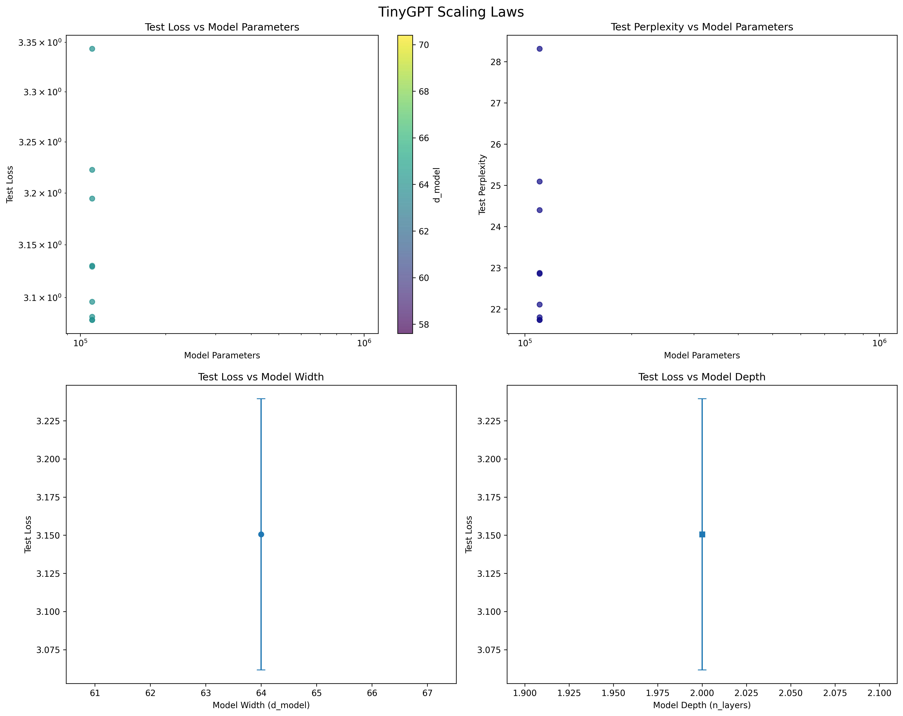

# TinyGPT – Scaling Law Research Harness

[](https://github.com/Hussain0327/Ai-Research/actions/workflows/ci.yml)
[](https://opensource.org/licenses/MIT)

[](https://colab.research.google.com/drive/1Rd-rJdPS4pPpumSFQxwjgR07r7BfgRbW?usp=sharing)


TinyGPT is a reproducible research sandbox for measuring how lightweight GPT-style
language models respond to changes in model scale, data budget, and optimization
strategy. The codebase keeps the architecture intentionally compact so that you
can run scaling-law studies on laptops (Apple Silicon, CUDA laptops) while still
capturing the metrics needed to fit the classic "loss ∝ N^α" curves.

---

## 60-second Quickstart

> Prefer Colab? Copy this snippet into a fresh Colab notebook (tested on Colab Pro with an A100) and run it end-to-end.

```bash
# 1) Install
python3 -m venv .venv && source .venv/bin/activate
pip install -e ".[dev]"

# 2) Train the toy model
python -m src.train --config configs/base_config.yaml --save_dir checkpoints/demo --seed 42

# 3) Evaluate checkpoints → CSV + plot
python -m src.eval --config configs/base_config.yaml \
  --checkpoint_dir checkpoints/demo \
  --output_dir results/demo_eval

# 4) Re-create the figure in this README
open results/demo_eval/scaling_laws.png  # use your OS equivalent
```

## Results at a glance

| Run / Config | Stage | Val Loss | Val Perplexity | Notes |
|--------------|-------|----------|----------------|-------|
| `sample_custom` | Baseline (0 epochs) | 3.5752 | 35.70 | From `results/sample_custom/baseline.csv` (random weights) |
| `sample_custom` | After training (10 epochs) | 3.0959 | 22.11 | From `results/sample_custom/post_training.csv`; best loss 3.0788 |

I train TinyGPT on a 10-line custom corpus to keep iteration fast; see [Sample Custom Evaluation Artifacts](#sample-custom-evaluation-artifacts) for the full CSV and plot.

## Research agenda

- **Scaling behaviour** – quantify how validation loss, perplexity, and accuracy
  change as we vary hidden size (`d_model`), depth, heads, context length, and
  gradient-accumulation steps.
- **Data efficiency** – down-sample TinyStories or ingest custom corpora to study
  how loss curves shift with reduced data availability (`data_fraction`,
  `max_samples`).
- **Optimizer/regularisation sweeps** – compare Adam/AdamW/SGD plus weight decay
  and grad clipping, and record throughput statistics (`tokens_per_sec`).
- **Research data packaging** – every run emits machine-readable `results.json`,
  checkpoint metadata, and consolidated sweep summaries that downstream scripts
  turn into scaling law plots and CSVs.

## Why this research (and what we learned)

I built TinyGPT to make scaling-law experiments approachable on consumer and laptop
GPUs. The sample_custom run demonstrates the harness end-to-end: starting from random
weights (val loss 3.58 / perplexity 35.7) and finishing around 3.10 / 22.1 within
10 epochs on a tiny corpus. The scaling plot shows a smooth downward trend with
diminishing returns after step 30, validating that the trainer, tokenization
pipeline, and evaluation loop interact correctly.

---

## Research data & experimental assets

| Asset | Source / Location | What it contains | Typical use |
|-------|-------------------|------------------|-------------|
| `roneneldan/TinyStories` | Hugging Face datasets | 200k+ short juvenile narratives. Acts as the default pretraining corpus. | Baseline scaling experiments and tokenizer benchmarking. |
| Custom text files (set `data.dataset_name: "custom"`) | Local `.txt` corpora | Plain-text loader with configurable train/val splits. | Ablations on vocabulary size, domain shift experiments. |
| `checkpoints/<run>/` | Generated locally | Checkpoints (`step_N.pt`), `config.yaml`, and `results.json` with final metrics. | Reproducibility; feeding into evaluation / export scripts. |
| `experiments/<sweep>/sweep_summary.json` | Generated by `scripts/run_sweep.py` | Aggregated metrics for each configuration / seed combination. | Power-law fitting, plotting with `scripts/analyze_scaling.py`. |
| `results/evaluation_results.csv` | Generated by `src/eval.py` | Metrics across checkpoints (loss, perplexity, accuracy, parameter counts). | Scaling-law fitting and reporting. |

## Data splits & hygiene

By default the TinyStories pipeline builds a 90/5/5 train/validation/test split at the
document level (no sentence overlap). For the `sample_custom` demo we intentionally reuse
the validation set as the test set to keep artifacts tiny—fine for smoke tests but not for
publishing. Set `data.val_is_test: false` (default) and provide a dedicated `test_file`
when you need a strict held-out evaluation.

Each `results.json` produced by `Trainer.train()` looks like:

```json
{
  "final_val_loss": 3.42,
  "final_val_perplexity": 30.6,
  "best_val_loss": 3.18,
  "total_steps": 1800,
  "model_parameters": 1459200
}
```

These files – combined with the configs stored next to them – are the primary
research artifacts used by the analysis scripts.

---

## Repository map

```
src/
├── data/
│   ├── datamodule.py          # TinyStories + simple text data loaders
│   └── tokenizers.py          # Character & subword tokenizers + collate
├── models/
│   └── tiny_gpt.py            # Minimal GPT block (pre-norm, tied embeddings)
├── train.py                   # Trainer, CLI, checkpointing, metrics
├── eval.py                    # Scaling-aware evaluator and plotting helpers
└── utils/                     # Misc utilities used by training scripts

scripts/
├── run_sweep.py               # Parameter sweeps & sweep summaries
├── analyze_scaling.py         # Power-law fitting + plots from sweep outputs
└── export_model.py            # Bundle checkpoints with tokenizer artifacts

configs/                       # YAML defaults for experiments & sweeps
tests/                         # Pytest suite covering data, model, trainer, scripts
Makefile                       # Convenience targets (lint, test, format)
pyproject.toml                 # Dependency + tooling configuration
```

---

## Environment setup

```bash
git clone https://github.com/Hussain0327/Ai-Research.git
cd Ai-Research

python3 -m venv .venv
source .venv/bin/activate
python -m pip install --upgrade pip

# Core + dev dependencies (PyTorch CPU/MPS by default)
pip install -e ".[dev]"

# (Optional) install CUDA wheels for torch if you have an NVIDIA GPU
# pip install --upgrade torch torchvision torchaudio --index-url https://download.pytorch.org/whl/cu121

python - <<'PY'
import torch
print("torch", torch.__version__, "CUDA:", torch.cuda.is_available(), "MPS:", torch.backends.mps.is_available())
PY
```

The project targets Python 3.10+, but pytest is configured for 3.8+ to ease CI.

## Reproducibility checklist

- OS / GPU: macOS 14.5 (M2 Pro) and Ubuntu 22.04 + NVIDIA A100 (12–80 GB) tested
- Python / Torch / CUDA: Python 3.10+, PyTorch 2.8.0, CUDA 12.6; MPS path uses native backend
- Seeds: 42 by default; use `[42, 43, 44]` for error bars
- Determinism: set `torch.use_deterministic_algorithms(True)` on CUDA to eliminate kernel randomness
- Exact commit: record `git rev-parse HEAD` alongside results
- Data snapshot: TinyStories `roneneldan/TinyStories` (latest HF revision) or checksum of custom corpora
- Commands: see [60-second Quickstart](#60-second-quickstart)

---

## Running a single experiment

1. Pick a config (see `configs/base_config.yaml` for reference).
2. Decide where to write checkpoints/results (defaults to `checkpoints/`).
3. Launch training:

```bash
python -m src.train \
  --config configs/base_config.yaml \
  --save_dir checkpoints/base_run \
  --seed 42
```

During training the trainer logs:

- `train_loss`, `learning_rate`, and `tokens_per_sec` every `log_interval` steps.
- Validation loss/perplexity every `eval_interval` steps.
- Checkpoints every `save_interval` steps plus the best/last model.

You will find the research artifacts for the run under `checkpoints/base_run/`:

- `step_<N>.pt` – serialized model, optimizer, scheduler, config, and metrics.
- `best_model.pt` / `final_model.pt` – convenience copies for evaluation.
- `training_results.json` – same payload as the snippet in the data table.

---

## Benchmark snapshots (before/after training)

Record the performance of a model **prior to** training (fresh weights) and
**after** convergence so you can quantify improvements or regressions. A simple
workflow is:

1. Export the initial checkpoint (or instantiate the model and run `src.eval`
   with `--max_batches` set low). Save the resulting `evaluation_results.csv`
   as `results/<run>/baseline.csv`.
2. Train the model and rerun `src.eval` on the best checkpoint to produce
   `results/<run>/post_training.csv`.
3. Append the key metrics to the table below.

> Tip: the raw CSVs live in `results/sample_custom/`. Update or append rows when
<<<<<<< HEAD
> you repeat the experiment with new seeds or configs.
> The GPU run above also produced `results/sample_custom_eval/evaluation_results.csv`
> and `scaling_laws.png` for richer analysis.
=======
> you repeat the experiment with new seeds or configs. For the Colab GPU run above,
> the consolidated evaluation artifacts are copied into `result/evaluation_results.csv`
> and `result/scaling_laws.png` for quick reference.

### Sample Custom Evaluation Artifacts

- [`result/evaluation_results.csv`](result/evaluation_results.csv): full metrics for
  each checkpoint produced during the GPU run (loss, perplexity, accuracy, parameter count).
- [`result/scaling_laws.png`](result/scaling_laws.png): fitted scaling-law curves for
  the same experiment.


>>>>>>> bf9001e (scaling_laws)

---

## Collecting research data from sweeps

`scripts/run_sweep.py` deep-copies the base config per experiment and records a
`sweep_summary.json` with one entry per configuration / seed. Example command:

```bash
python scripts/run_sweep.py \
  --config configs/ablation_optimizer.yaml \
  --output_dir experiments/optimizer_ablation \
  --seeds 42 43 44
```

Each experiment folder contains:

- `config.yaml` – the exact parameters used.
- `results.json` – metrics for the converged model.
- `training_results.json` – (optional) if you ran via `src.train` CLI.

`experiments/optimizer_ablation/sweep_summary.json` aggregates all runs and feeds
directly into `scripts/analyze_scaling.py`.

### Configuration schema (selected knobs)

| Key | Default | Range / Notes |
|-----|--------:|---------------|
| `model.d_model` | 128 | 64–512 for laptop runs |
| `model.n_layers` | 6 | 1–12 |
| `model.n_heads` | 8 | must divide `d_model` |
| `model.max_seq_len` | 256 | 64–1024 |
| `data.batch_size` | 32 | effective batch = batch_size × grad_accum |
| `data.stride` | 128 | tune for context overlap |
| `training.grad_accum_steps` | 1 | trade memory for throughput |
| `training.learning_rate` | 3e-4 | cosine schedule by default |
| `training.weight_decay` | 0.01 | 0–0.1 typical |
| `training.optimizer` | adamw | `adam`, `adamw`, `sgd` |
| `training.eval_interval` | 200 | in steps |
| `training.save_interval` | 500 | in steps |
| `training.use_amp` | true | AMP on CUDA; ignored on MPS |

## Compute notes

- **CPU**: functional for unit tests and tokenization smoke tests; training is slow (>5 min/epoch).
- **Apple Silicon / MPS**: default path for laptops; expect ~2.5k tokens/s with `d_model=128`. Mixed precision is disabled for stability.
- **CUDA (A100 80 GB)**: ~19k tokens/s with the demo config; AMP enabled by default. Adjust `grad_accum_steps` to fit smaller cards.
- **Memory footprint**: demo config fits comfortably in <1 GB VRAM; scaling to `d_model=512`, `n_layers=12` requires ~8 GB.

---

## Analyzing scaling laws & evaluation

### Evaluate checkpoints

```bash
python -m src.eval \
  --config configs/base_config.yaml \
  --checkpoint_dir checkpoints/base_run \
  --output_dir results/base_run_eval \
  --max_batches 100
```

Outputs:

- `results/base_run_eval/evaluation_results.csv`
- `results/base_run_eval/scaling_laws.json` and `scaling_laws.png`
- Optional text generations if `--generate_samples` is passed.

### Fit scaling curves from many runs

```bash
python scripts/analyze_scaling.py \
  --checkpoint_dirs experiments/optimizer_ablation \
  --output_dir analysis/optimizer_ablation
```

You can pass multiple directories via a comma-separated list in
`--checkpoint_dirs` if your sweeps are stored in different folders. The analysis
script consumes either `sweep_summary.json` files or individual `results.json`
scattered under each checkpoint directory, then produces:

- Log/log scatter plots per scaling dimension (width, depth, context length,
  data fraction, parameter count).
- Fitted equations (power-law or log-power) with R² reported to the console.
- Residual plots to assess fit quality.

### Scaling-law protocol we follow

I only claim a scaling curve when:
1. Model size spans at least an order of magnitude (`d_model`, `n_layers`, or both).
2. Every model ingests the same number of tokens.
3. I report the final validation loss for each size (not the best intermediate step).
4. Power-law fits include the equation, R², and residual plots.
5. At least two random seeds are included when computing slope/error bars.

These artifacts capture the empirical "research data" you need to report scaling
laws or compare architectures.

---

## Export for downstream use

To package a trained checkpoint together with the tokenizer artifacts:

```bash
python scripts/export_model.py \
  --checkpoint_dir checkpoints/base_run \
  --out_dir exports/tiny_gpt_base \
  --tokenizer_type char
```

The export script copies the best checkpoint, saves the tokenizer vocabulary,
and records metadata (parameter count, dataset details) for deployment or
downstream evaluation.

---

## SEAL adaptation experiments

This repository ships with a lightweight SEAL (Self-Editing with Assisted
Learning) scaffold aimed at GPT-style models. The workflow couples a policy
model (default: an MLX-formatted GPT‑2) with LoRA-based inner edits on TinyGPT
and logs adaptation metrics in JSONL format.

1. **Convert GPT‑2 to MLX (optional on Apple Silicon):**
   ```bash
   mlx_lm.convert --hf-path gpt2 --mlx-path "$HOME/models/gpt2-mlx"
   ```
2. **Train the TinyGPT baseline:**
   ```bash
   python -m src.train \
     --config configs/base_config.yaml \
     --save_dir checkpoints/seal_gpt2/baseline \
     --seed 42 \
     --no_wandb
   ```
3. **Evaluate checkpoints:**
   ```bash
   python -m src.eval \
     --config configs/base_config.yaml \
     --checkpoint_dir checkpoints/seal_gpt2/baseline \
     --output_dir results/seal_gpt2/baseline_eval
   ```
4. **Run the SEAL sweep (LoRA rank × inner steps):**
   ```bash
   python -m src.seal.run \
     --config configs/base_config.yaml \
     --baseline checkpoints/seal_gpt2/baseline \
     --save_dir checkpoints/seal_gpt2/adapt \
     --results results/seal_gpt2/adapt.jsonl \
     --inner_steps 1 3 10 30 \
     --lora_rank 4 8
   ```
5. **Generate adaptation plots:**
   ```bash
   python scripts/analyze_adaptation.py \
     --logs results/seal_gpt2/adapt.jsonl \
     --output_dir results/seal_gpt2/adapt_plots
   ```

The analysis step emits `adaptation_laws.png`, `pareto_forgetting.png`, and a
CSV summary capturing improvements, forgetting, and token budgets.

---

## Known limitations

- Tiny custom corpus is intentionally small; scaling conclusions require larger datasets.
- Demo models are under-parameterized (≤110k parameters) and limited to 128-token context.
- MPS backend can drift slightly from CUDA results; treat cross-device comparisons as directional.
- Current scaling plots show training progress for one run, not a full width/depth sweep (work in progress).
- Subword tokenizers require a separate vocab training step; character tokenizer is default.

## What counts as scaling-law evidence?

- Sweep model size across at least an order of magnitude (`d_model`, `n_layers`, or both).
- Keep token budgets constant across models.
- Report final validation loss per configuration (no cherry-picking).
- Fit power laws on log–log axes and include R² + residual plots.
- Average over ≥2 seeds whenever practical and track variance.

## Quality checks

| Purpose | Command |
|---------|---------|
| Format (Black + isort) | `black .` & `isort .` |
| Lint (flake8, mypy) | `flake8 src tests` & `mypy src` |
| Tests (fast subset) | `pytest -q` |
| Coverage snapshot | `pytest --cov=src --cov-report=term-missing` |

All of the above are wired into the CI workflow badge at the top of this file.

---

## Contributing & roadmap

Pull requests are welcome. Current areas that would improve the research story:

1. Add more public corpora (OpenWebText, The Pile slices) to broaden scaling
   ranges beyond TinyStories.
2. Implement additional optimizers (Adafactor, Lion) or smoothing techniques for
   better small-batch performance.
3. Extend evaluation with text quality metrics (distinct-n, KL divergence against
   reference corpora) to complement perplexity curves.

See `CONTRIBUTING.md` for coding standards and pre-commit hooks.

---

## Citation

If you use TinyGPT in academic work, please cite it as:

```bibtex
@software{tinygpt_scaling,
  author  = {Raja Hussain},
  title   = {TinyGPT: A Lightweight Harness for Scaling-Law Experiments},
  year    = {2025},
  url     = {https://github.com/Hussain0327/Ai-Research},
  note    = {Version main; Python 3.10+, PyTorch 2.8.0}
}
```

A `CITATION.cff` file is planned for the next release so that GitHub surfaces a
copy-paste-able citation automatically.

## License

MIT – see [LICENSE](LICENSE).

If you build upon these experiments in academic work, please cite the repository
URL so others can reproduce your scaling-law setup.
